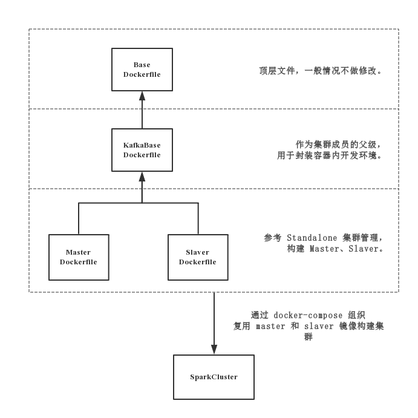

# SparkCluster 项目

### 一、概述

SparkCluster 项目旨在为「新房 ETL 工程」、「UUID 抗抖动算法」提供可拓展、高性能的分布式计算平台。 

相比于之前纯 Python 编写的 ETL 工作流，SparkCluster 有以下提升：

- 高速计算：较先前脚本提升 40 倍计算速度；
- 容器化：使用 Docker 封装，从而方便移植至不同平台。

### 二、先决条件

#### Docker 和 Spark 基础

SparkCluster 将 Spark 所有组件完整封入 Docker 镜像镜像之中。因此，若无 Docker、Spark 使用经验，请先分别阅读其相关文档。

- [Docker 中文文档](https://docs.docker-cn.com/)
- [Spark 2.3.0 官方文档](https://spark.apache.org/docs/2.3.0/)

#### 配置环境

##### 1、硬件基础

| Component | 规模 | 备注 |
|:---|:---|:---|
|CPU|4 核 16 线程||
|内存|至少 64G | 可用 swap 来凑 |

##### 2、软件基础

| Applications | Versions | 备注 |
|:---|:---|:---|
|Spark|2.3.0||
|Docker|17.03.0-ce 或以上|需修改 Docker 启动参数|
|docker-compose|1.20.1
|OpenJDK|1.8.0 或以上|若仅部署集群，则此依赖可以忽略。|
 
### 三、快速部署

##### 1. 项目克隆至本地

`git clone git@10.30.2.205:ProjectNewHouse/SparkCluster.git`

##### 2. 启动

`cd SparkCluster && docker-compose up -d`

##### 3. 关闭

`docker-compose down`

### 四、项目设计与结构

**i. SparkCluster 文件目录树**：

```
.
├── Base
│   └── Dockerfile
├── docker-compose.yml
├── KafkaBase
│   ├── Dockerfile
│   ├── requirements.txt
│   └── spark-streaming-kafka_2.11-2.2.1.jar
├── Logs
├── Master
│   ├── Dockerfile
│   └── master.sh
└── Slaver
    ├── Dockerfile
    └── slaver.sh
```

结构说明：

- `Base` 下的 `Dockerfile` 用于构建底层环境，无需改动；
- `KafkaBase` 下的 `Dockerfile` 用于构建 Spark-Kafka-Streaming 和 Python 依赖环境；
- `Master` 下的 `Dockerfile` 用于构建 Spark-Master 服务器；
- `Slaver` 下的 `Dockerfile` 用于构建 Spark-Worker 服务器；
- `Logs` 可作为挂载容器内日志的目录；
- `docker-compose.yml` 集群部署方案。

空间层级：



SparkCluster 共三层，层级间向上继承。

*温馨提示：* 

> 通常情况下无需修改任何 `Dockerfile`。若需要修改 `Dockerfile`，需要记住修改之后必须重新使用 `docker build -t <ImageName> <Address>`打包，建议自行查阅文档。
> 
> 每一层级的 `Dockerfile` 若发生修改，那么其下层都必须重新打包。因此，顶层层级仅部署 Spark、JDK 等耗时且不常修改的底层架构。频繁修改文件，将耗费较大的开销。


**ii. SparkCluster 集群内部**


### 五、Troubleshooting


